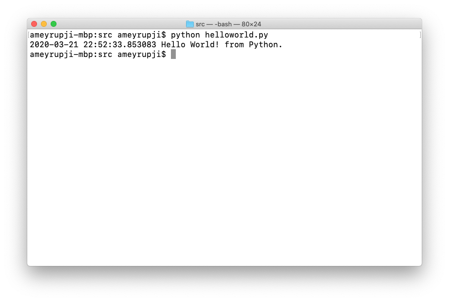

| ◂ Previous |
|-----|

# python-helloworld

A simple python hello world script. This example creates a Python script that prints "Hello World".

## Prerequisites

- Python - >=3.5
- Visual Studio Code

## System Configuration at time of test

- macOS Catalina - Version 10.15.3
- Python - Version 3.7.6

## Initial Setup

### Code

Create a `src/helloworld.py` with the following code:

```python 
#!/usr/local/bin/python3 

import datetime

now = datetime.datetime.now()
print("{now} Hello World! from Python.".format(now=now))
```

## Test

Open Terminal run the following command:

```bash
cd src
python helloworld.py
```




## Useful Links

- https://medium.com/@pandit.summit/kubernetes-cron-job-with-python-image-in-minikube-windows-10-ac33851d573d

| [Next ▸](https://github.com/ameyrupji-k8s/docker-python-helloworld) |
|-----|
